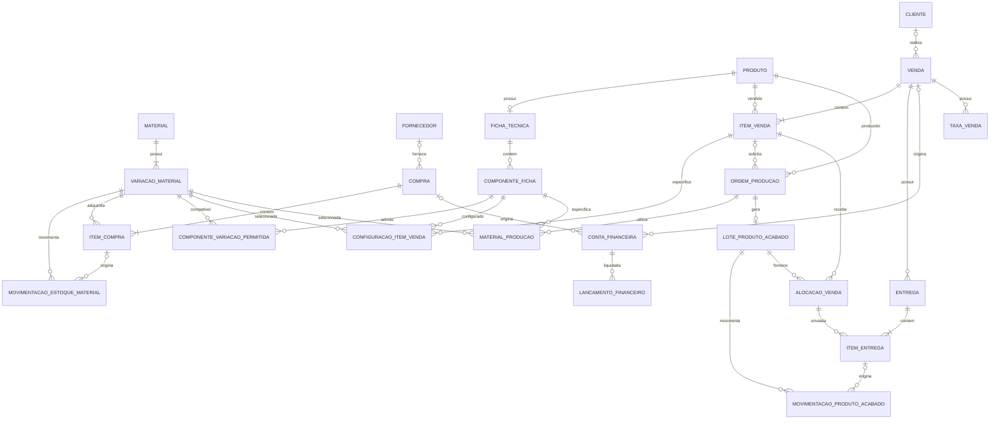

# 06 — Modelagem de Dados

> **Versão:** 1.0 — proposta consolidada para implementação  
> **Projeto:** EntreTrama  
> **Autora:** Thalita Judice  
> **Data:** 24/09/2026  
> **Status:** Modelo lógico proposto; sujeito a ajustes técnicos durante a implementação.

---

## Objetivo do documento

Definir as entidades, os atributos, os relacionamentos e as restrições de integridade que sustentarão o MVP do EntreTrama, sistema de informação para gestão de um pequeno negócio artesanal. A modelagem contempla materiais, compras, custos, fichas técnicas personalizáveis, produção, produtos acabados, clientes, vendas, entregas e financeiro.

O documento complementa `04-regras-de-negocio.md` e `05-casos-de-uso.md`. As decisões consolidadas nas discussões de modelagem devem ser incorporadas nesses documentos caso ainda não constem das versões do repositório. Os nomes de campos apresentados são sugestões para a implementação com Python, SQLAlchemy e PostgreSQL, e não representam tabelas já criadas.

### Escopo e premissas

- MVP de usuário único, sem autenticação e sem integração automática com Shopee, TikTok Shop ou instituições financeiras.
- Materiais controlados em **gramas (`g`)** ou **unidades (`un`)**, conforme o material; embalagens de compra são convertidas para a unidade de controle.
- Estoque físico, comprometimento de materiais e reserva de produtos acabados são conceitos distintos.
- Produto representa o **modelo artesanal**; as cores e os acabamentos de uma peça são definidos na configuração de cada produção ou item de venda.
- Uma ordem pode produzir várias unidades de configuração idêntica; configurações diferentes exigem ordens distintas.
- Compra, recebimento de materiais, produção, entrega e pagamento possuem efeitos independentes.
- Valores monetários e quantidades devem utilizar tipos decimais exatos (`NUMERIC`/`Decimal`), nunca `float`.

---

## 1. Convenções de modelagem

| Convenção | Definição |
|---|---|
| `id` | Chave primária, preferencialmente `BIGINT` gerado pelo banco. |
| `*_id` | Chave estrangeira para a entidade indicada. |
| `NUMERIC(14,2)` | Valor monetário em reais. |
| `NUMERIC(14,3)` | Quantidade de material; gramas podem ser fracionadas. |
| `NUMERIC(7,4)` | Proporções e custos unitários; a precisão efetiva do custo por grama pode exigir `NUMERIC(18,6)`. |
| `created_at`, `updated_at` | Datas de auditoria para registros relevantes. |
| `ativo` | Desativação lógica de cadastros com histórico. |
| `status` | Estado controlado por enumeração ou restrição `CHECK`. |

Totais, saldos, disponibilidades e situações deriváveis devem ser **calculados a partir dos registros de origem** sempre que possível. Caso algum total seja armazenado por desempenho ou por necessidade de histórico, sua atualização deverá ocorrer na mesma transação que altera os dados correspondentes.

---

## 2. Materiais e estoque

### 2.1 `MATERIAL`

Representa o material principal, sem distinguir cor ou acabamento.

| Campo | Tipo sugerido | Regra |
|---|---|---|
| `id` | BIGINT | PK |
| `nome` | VARCHAR(150) | Obrigatório; ex.: Fio Amigurumi |
| `categoria` | VARCHAR(80) | Ex.: Fio, Ferragem, Embalagem |
| `unidade_controle` | VARCHAR(2) | `g` ou `un` |
| `ativo` | BOOLEAN | Padrão `true` |
| `observacoes` | TEXT | Opcional |

### 2.2 `VARIACAO_MATERIAL`

Cada cor, acabamento ou apresentação funcional controlada separadamente possui estoque e custo médio próprios. Materiais sem variações comerciais terão uma variação padrão, por exemplo, “Única”.

| Campo | Tipo sugerido | Regra |
|---|---|---|
| `id` | BIGINT | PK |
| `material_id` | BIGINT | FK → `MATERIAL` |
| `descricao` | VARCHAR(150) | Ex.: Rosa, Dourado, Única |
| `codigo_referencia` | VARCHAR(100) | Opcional |
| `estoque_minimo` | NUMERIC(14,3) | Padrão zero; não negativo |
| `custo_medio_atual` | NUMERIC(18,6) | Custo por `g` ou `un`; não negativo |
| `ativa` | BOOLEAN | Padrão `true` |

**Unicidade sugerida:** (`material_id`, `descricao`) para evitar variações duplicadas no mesmo material, respeitada a política de normalização de nomes.

### 2.3 `MOVIMENTACAO_ESTOQUE_MATERIAL`

Histórico imutável de entradas, consumos, ajustes e reversões do estoque físico. O saldo físico é a soma das quantidades assinadas da variação.

| Campo | Tipo sugerido | Regra |
|---|---|---|
| `id` | BIGINT | PK |
| `variacao_material_id` | BIGINT | FK → `VARIACAO_MATERIAL` |
| `tipo` | VARCHAR(30) | `ENTRADA_COMPRA`, `CONSUMO_PRODUCAO`, `AJUSTE`, `REVERSAO` |
| `quantidade_delta` | NUMERIC(14,3) | Positiva para entrada; negativa para saída; diferente de zero |
| `data_movimentacao` | TIMESTAMP | Obrigatório |
| `item_compra_id` | BIGINT | FK opcional → `ITEM_COMPRA` |
| `ordem_producao_id` | BIGINT | FK opcional → `ORDEM_PRODUCAO` |
| `movimentacao_origem_id` | BIGINT | FK opcional para reversão |
| `motivo` | TEXT | Obrigatório para ajuste manual |
| `custo_unitario_referencia` | NUMERIC(18,6) | Custo histórico, quando aplicável |

Uma confirmação de compra ou conclusão de produção não poderá gerar a mesma movimentação duas vezes. Reversões devem criar novos registros, não apagar o histórico.

### 2.4 Saldos dos materiais

```text
estoque_fisico(variacao) = soma(quantidade_delta)
quantidade_comprometida(variacao) = soma dos compromissos ativos das produções não concluídas/canceladas
estoque_disponivel(variacao) = estoque_fisico - quantidade_comprometida
```

O estoque disponível **pode ser negativo**, indicando necessidade de reposição; isso não impede registrar uma encomenda ou planejar uma produção. A quantidade física negativa, por outro lado, deve ser tratada como inconsistência a validar ou como exceção expressamente controlada na conclusão da produção.

---

## 3. Fornecedores e compras

### 3.1 `FORNECEDOR`

| Campo | Tipo sugerido | Regra |
|---|---|---|
| `id` | BIGINT | PK |
| `nome` | VARCHAR(150) | Obrigatório |
| `telefone`, `email` | VARCHAR | Opcionais |
| `observacoes` | TEXT | Opcional |
| `ativo` | BOOLEAN | Padrão `true` |

### 3.2 `COMPRA`

| Campo | Tipo sugerido | Regra |
|---|---|---|
| `id` | BIGINT | PK |
| `fornecedor_id` | BIGINT | FK opcional → `FORNECEDOR` |
| `data_compra` | DATE | Obrigatória |
| `status` | VARCHAR(20) | `RASCUNHO`, `CONFIRMADA`, `CANCELADA` |
| `frete` | NUMERIC(14,2) | Padrão zero |
| `desconto_geral` | NUMERIC(14,2) | Padrão zero |
| `observacoes` | TEXT | Opcional |
| `confirmada_em` | TIMESTAMP | Preenchido na confirmação |

`valor_materiais` e `total_compra` são calculados a partir dos itens, frete e desconto geral. A confirmação gera entradas físicas dos itens **uma única vez**. O lançamento da compra não equivale a pagamento.

### 3.3 `ITEM_COMPRA`

| Campo | Tipo sugerido | Regra |
|---|---|---|
| `id` | BIGINT | PK |
| `compra_id` | BIGINT | FK → `COMPRA` |
| `variacao_material_id` | BIGINT | FK → `VARIACAO_MATERIAL` |
| `quantidade_comprada` | NUMERIC(14,3) | Quantidade de apresentações; positiva |
| `apresentacao` | VARCHAR(100) | Ex.: novelo de 125 g, pacote com 10 un. |
| `quantidade_por_apresentacao` | NUMERIC(14,3) | Conversão para unidade de controle; positiva |
| `quantidade_convertida` | NUMERIC(14,3) | `quantidade_comprada × quantidade_por_apresentacao` |
| `valor_itens` | NUMERIC(14,2) | Valor bruto do item |
| `desconto_item` | NUMERIC(14,2) | Padrão zero |

**Exemplo:** 2 novelos de 125 g por R$ 36,00 equivalem a 250 g e custo de aquisição de R$ 0,144/g. Frete e desconto geral permanecem identificados na compra e **não entram no custo médio do material neste MVP**; o desconto do item entra.

```text
custo_medio_novo =
  (estoque_fisico_anterior × custo_medio_anterior +
   quantidade_entrada × custo_unitario_liquido_do_item)
  / (estoque_fisico_anterior + quantidade_entrada)
```

A fórmula exige tratamento explícito para estoque anterior zero, ajustes de estoque e cancelamento de compras. A política de recomposição do custo médio em cancelamentos históricos deverá preservar a rastreabilidade dos valores utilizados em produções já concluídas.

**Fluxo de interface aprovado:** ao lançar uma compra, o usuário poderá cadastrar material ou variação inexistente e retornar ao formulário sem perder os itens já preenchidos. Esse comportamento não exige entidade adicional no banco.

---

## 4. Produtos e fichas técnicas

### 4.1 `PRODUTO`

Representa o modelo comercializável, não cada combinação de cores.

| Campo | Tipo sugerido | Regra |
|---|---|---|
| `id` | BIGINT | PK |
| `nome` | VARCHAR(150) | Obrigatório |
| `categoria` | VARCHAR(80) | Ex.: Bolsa, Bag Charm, Amigurumi |
| `preco_referencia` | NUMERIC(14,2) | Opcional; não negativo |
| `permite_encomenda` | BOOLEAN | Padrão `true` |
| `permite_pronta_entrega` | BOOLEAN | Padrão `true` |
| `ativo` | BOOLEAN | Padrão `true` |
| `observacoes` | TEXT | Opcional |

### 4.2 `FICHA_TECNICA`

| Campo | Tipo sugerido | Regra |
|---|---|---|
| `id` | BIGINT | PK |
| `produto_id` | BIGINT | FK → `PRODUTO` |
| `tempo_estimado_horas` | NUMERIC(10,2) | Não negativo |
| `valor_hora_referencia` | NUMERIC(14,2) | Não negativo |
| `status` | VARCHAR(20) | `PENDENTE`, `COMPLETA` |
| `observacoes` | TEXT | Opcional |

No MVP, considera-se uma ficha técnica **vigente** por produto. Alterações posteriores não podem modificar retroativamente a configuração, as quantidades ou os custos históricos das ordens já criadas. Se for necessário versionamento completo da ficha, este será um refinamento posterior.

### 4.3 `COMPONENTE_FICHA`

Descreve cada parte da peça e seu consumo estimado **por unidade produzida**.

| Campo | Tipo sugerido | Regra |
|---|---|---|
| `id` | BIGINT | PK |
| `ficha_tecnica_id` | BIGINT | FK → `FICHA_TECNICA` |
| `nome` | VARCHAR(150) | Ex.: Pétalas, Corpo, Mosquetão |
| `quantidade_base` | NUMERIC(14,3) | Consumo por peça; positivo |
| `margem_consumo_percentual` | NUMERIC(7,4) | Padrão zero; não negativa |
| `personalizavel` | BOOLEAN | Obrigatório |
| `variacao_fixa_id` | BIGINT | FK opcional → `VARIACAO_MATERIAL` |
| `observacoes` | TEXT | Opcional |

Um componente fixo aponta para uma variação determinada. Um componente personalizável admite uma ou mais variações compatíveis.

### 4.4 `COMPONENTE_VARIACAO_PERMITIDA`

Tabela associativa para limitar as escolhas possíveis em componentes personalizáveis.

| Campo | Tipo sugerido | Regra |
|---|---|---|
| `componente_ficha_id` | BIGINT | FK → `COMPONENTE_FICHA` |
| `variacao_material_id` | BIGINT | FK → `VARIACAO_MATERIAL` |

PK composta (`componente_ficha_id`, `variacao_material_id`). A aplicação deve validar que as variações de um componente compartilham unidade de controle compatível com seu consumo.

**Personalização aprovada:** um mesmo componente pode combinar várias cores, distribuindo seu consumo entre elas. Exemplo: corpo da bolsa de 500 g = 300 g de fio bege (60%) + 200 g de fio terracota (40%). As proporções de cada componente devem totalizar 100%, ressalvado o arredondamento decimal.

---

## 5. Clientes, vendas e configuração vendida

### 5.1 `CLIENTE`

| Campo | Tipo sugerido | Regra |
|---|---|---|
| `id` | BIGINT | PK |
| `nome` | VARCHAR(150) | Obrigatório quando houver cadastro |
| `telefone`, `email` | VARCHAR | Opcionais |
| `observacoes` | TEXT | Opcional |
| `ativo` | BOOLEAN | Padrão `true` |

### 5.2 `VENDA`

| Campo | Tipo sugerido | Regra |
|---|---|---|
| `id` | BIGINT | PK |
| `cliente_id` | BIGINT | FK opcional → `CLIENTE` |
| `data_venda` | DATE | Obrigatória |
| `canal` | VARCHAR(40) | Ex.: Shopee, TikTok Shop, Instagram, Direta |
| `frete_cobrado` | NUMERIC(14,2) | Padrão zero |
| `desconto` | NUMERIC(14,2) | Padrão zero |
| `status` | VARCHAR(25) | Ex.: `ABERTA`, `CONCLUIDA`, `CANCELADA` |
| `observacoes` | TEXT | Opcional |

`valor_bruto_venda = soma(subtotais dos itens) + frete_cobrado − desconto`. A situação de pagamento e a situação de entrega são **derivadas separadamente**, não confundidas com o status comercial.

### 5.3 `ITEM_VENDA`

| Campo | Tipo sugerido | Regra |
|---|---|---|
| `id` | BIGINT | PK |
| `venda_id` | BIGINT | FK → `VENDA` |
| `produto_id` | BIGINT | FK → `PRODUTO` |
| `quantidade` | INTEGER | Positiva |
| `preco_unitario` | NUMERIC(14,2) | Valor histórico; não negativo |
| `observacoes` | TEXT | Opcional |

`subtotal = quantidade × preco_unitario`. Peças do mesmo produto com configurações diferentes devem constar como itens distintos.

### 5.4 `CONFIGURACAO_ITEM_VENDA`

Registra as escolhas solicitadas pela cliente por componente. Uma linha corresponde a **uma variação escolhida**; várias linhas do mesmo componente representam uma combinação de cores.

| Campo | Tipo sugerido | Regra |
|---|---|---|
| `id` | BIGINT | PK |
| `item_venda_id` | BIGINT | FK → `ITEM_VENDA` |
| `componente_ficha_id` | BIGINT | FK → `COMPONENTE_FICHA` |
| `variacao_material_id` | BIGINT | FK → `VARIACAO_MATERIAL` |
| `proporcao` | NUMERIC(7,4) | Entre zero e um; soma 1 por componente |
| `quantidade_por_peca` | NUMERIC(14,3) | Quantidade planejada para uma unidade |

A configuração da venda é um **registro histórico da escolha**, mesmo que a ficha técnica ou o preço de referência sejam alterados posteriormente. Uma venda pode ser registrada com ficha ainda pendente, mas a reserva/produção dependente de consumo só será calculada quando a configuração necessária estiver completa.

---

## 6. Ordens de produção e materiais comprometidos

### 6.1 `ORDEM_PRODUCAO`

| Campo | Tipo sugerido | Regra |
|---|---|---|
| `id` | BIGINT | PK |
| `produto_id` | BIGINT | FK → `PRODUTO` |
| `item_venda_id` | BIGINT | FK opcional → `ITEM_VENDA` |
| `quantidade_planejada` | INTEGER | Positiva |
| `origem` | VARCHAR(20) | `ENCOMENDA` ou `PRONTA_ENTREGA` |
| `status` | VARCHAR(30) | `AGUARDANDO_MATERIAL`, `AGUARDANDO_PRODUCAO`, `EM_PRODUCAO`, `CONCLUIDA`, `CANCELADA` |
| `data_prevista` | DATE | Opcional |
| `iniciada_em`, `concluida_em` | TIMESTAMP | Opcionais |
| `observacoes` | TEXT | Opcional |

Uma ordem para pronta entrega não tem `item_venda_id`. Uma ordem de encomenda referencia o item que atende. **Todas as unidades da mesma ordem possuem configuração idêntica.** Uma ordem poderá atender apenas a quantidade faltante de um item, após a reserva de peças prontas.

### 6.2 `MATERIAL_PRODUCAO`

Fotografia dos materiais escolhidos e das quantidades da ordem. Uma linha corresponde a uma variação de um componente na produção.

| Campo | Tipo sugerido | Regra |
|---|---|---|
| `id` | BIGINT | PK |
| `ordem_producao_id` | BIGINT | FK → `ORDEM_PRODUCAO` |
| `componente_ficha_id` | BIGINT | FK → `COMPONENTE_FICHA` |
| `variacao_material_id` | BIGINT | FK → `VARIACAO_MATERIAL` |
| `proporcao` | NUMERIC(7,4) | Soma 1 por componente |
| `quantidade_por_peca` | NUMERIC(14,3) | Quantidade planejada por unidade |
| `quantidade_total_prevista` | NUMERIC(14,3) | Quantidade por peça × quantidade da ordem, com margem aplicável |
| `custo_unitario_referencia` | NUMERIC(18,6) | Custo por `g`/`un` considerado no planejamento |
| `quantidade_consumida` | NUMERIC(14,3) | Consumo definitivo na conclusão, se ajustado |

Enquanto a ordem estiver ativa e com materiais planejados, `quantidade_total_prevista` integra o comprometimento da variação. Ao concluir, registra-se o consumo físico **uma única vez** e libera-se o comprometimento. Ao cancelar, libera-se o comprometimento sem consumir material.

Se a ficha estiver pendente, a ordem poderá existir aguardando planejamento, mas não gerará comprometimento fictício. O custo histórico da produção deve preservar o custo unitário considerado no momento definido para a conclusão, sem ser reescrito por compras posteriores.

---

## 7. Produtos acabados, reservas e entregas

### 7.1 `LOTE_PRODUTO_ACABADO`

Um lote representa a quantidade concluída de uma ordem com uma configuração específica. Um lote pode conter uma única peça.

| Campo | Tipo sugerido | Regra |
|---|---|---|
| `id` | BIGINT | PK |
| `ordem_producao_id` | BIGINT | FK única → `ORDEM_PRODUCAO` |
| `produto_id` | BIGINT | FK → `PRODUTO` |
| `quantidade_produzida` | INTEGER | Positiva |
| `data_conclusao` | TIMESTAMP | Obrigatória |
| `custo_total_producao` | NUMERIC(14,2) | Valor histórico |

A configuração do lote é recuperada pelos registros imutáveis de `MATERIAL_PRODUCAO` de sua ordem. Não é necessário cadastrar novamente um produto para cada cor.

### 7.2 `ALOCACAO_VENDA`

Vincula uma quantidade de determinado lote a um item de venda. É a origem da **reserva** de peças prontas.

| Campo | Tipo sugerido | Regra |
|---|---|---|
| `id` | BIGINT | PK |
| `item_venda_id` | BIGINT | FK → `ITEM_VENDA` |
| `lote_produto_acabado_id` | BIGINT | FK → `LOTE_PRODUTO_ACABADO` |
| `quantidade_alocada` | INTEGER | Positiva |
| `quantidade_liberada` | INTEGER | Padrão zero; por cancelamento/desreserva |
| `created_at` | TIMESTAMP | Obrigatório |

A alocação somente é permitida quando produto e configuração forem compatíveis. Uma mesma venda pode ser atendida por vários lotes e por produção complementar.

### 7.3 `ENTREGA`

| Campo | Tipo sugerido | Regra |
|---|---|---|
| `id` | BIGINT | PK |
| `venda_id` | BIGINT | FK → `VENDA` |
| `data_entrega` | TIMESTAMP | Data de envio ou entrega física |
| `tipo` | VARCHAR(25) | `ENVIO` ou `PRESENCIAL` |
| `codigo_rastreio` | VARCHAR(120) | Opcional |
| `observacoes` | TEXT | Opcional |

### 7.4 `ITEM_ENTREGA`

| Campo | Tipo sugerido | Regra |
|---|---|---|
| `id` | BIGINT | PK |
| `entrega_id` | BIGINT | FK → `ENTREGA` |
| `alocacao_venda_id` | BIGINT | FK → `ALOCACAO_VENDA` |
| `quantidade` | INTEGER | Positiva |

O vínculo com a alocação preserva a origem de cada unidade enviada. A entrega deve pertencer à mesma venda do item alocado.

### 7.5 `MOVIMENTACAO_PRODUTO_ACABADO`

Livro de movimentações físicas de cada lote, para registrar entrada da produção, saída por entrega e eventual ajuste ou reversão.

| Campo | Tipo sugerido | Regra |
|---|---|---|
| `id` | BIGINT | PK |
| `lote_produto_acabado_id` | BIGINT | FK → `LOTE_PRODUTO_ACABADO` |
| `tipo` | VARCHAR(30) | `ENTRADA_PRODUCAO`, `SAIDA_ENTREGA`, `AJUSTE`, `REVERSAO` |
| `quantidade_delta` | INTEGER | Diferente de zero; entrada positiva, saída negativa |
| `item_entrega_id` | BIGINT | FK opcional → `ITEM_ENTREGA` |
| `data_movimentacao` | TIMESTAMP | Obrigatória |
| `motivo` | TEXT | Obrigatório para ajuste |

```text
fisico_lote = soma(movimentacoes_do_lote.quantidade_delta)
reservado_lote = soma(alocada - liberada - entregue) das alocações ativas
Disponivel_lote = fisico_lote - reservado_lote
```

**Exemplo de atendimento misto:** item de venda com três bag charms iguais; duas unidades prontas são alocadas e a ordem de produção é criada apenas para a unidade restante. Ao concluir a ordem, seu lote pode ser alocado ao mesmo item de venda.

**Momento da saída:** o estoque físico de produtos acabados diminui no envio ou entrega, **não** no pedido, na reserva ou no pagamento. Uma venda pode ter várias entregas parciais. A interface oferecerá a opção de entregar o pedido inteiro em uma operação simples.

---

## 8. Financeiro

### 8.1 `CONTA_FINANCEIRA`

Representa uma obrigação ou direito previsto, inclusive parcelas, com origem e vencimento próprios.

| Campo | Tipo sugerido | Regra |
|---|---|---|
| `id` | BIGINT | PK |
| `tipo` | VARCHAR(10) | `PAGAR` ou `RECEBER` |
| `categoria` | VARCHAR(80) | Ex.: Materiais, Venda, Aluguel |
| `descricao` | VARCHAR(255) | Obrigatória |
| `valor_previsto` | NUMERIC(14,2) | Positivo |
| `data_vencimento` | DATE | Opcional se ainda não definida |
| `compra_id` | BIGINT | FK opcional → `COMPRA` |
| `venda_id` | BIGINT | FK opcional → `VENDA` |
| `observacoes` | TEXT | Opcional |
| `cancelada_em` | TIMESTAMP | Opcional; cancelamento preserva histórico |

Uma compra ou venda pode gerar várias contas financeiras, incluindo sinal, parcelas e pagamento restante. Despesas avulsas podem existir sem compra ou venda associada. A situação da conta (`PENDENTE`, `PARCIAL`, `QUITADA`, `ATRASADA`, `CANCELADA`) deve ser derivada de vencimento, cancelamento e lançamentos.

### 8.2 `LANCAMENTO_FINANCEIRO`

Registra a movimentação **efetiva** de dinheiro. Cada lançamento liquida total ou parcialmente uma conta.

| Campo | Tipo sugerido | Regra |
|---|---|---|
| `id` | BIGINT | PK |
| `conta_financeira_id` | BIGINT | FK → `CONTA_FINANCEIRA` |
| `data_efetiva` | DATE | Obrigatória |
| `valor` | NUMERIC(14,2) | Positivo |
| `forma_pagamento` | VARCHAR(40) | Ex.: Pix, dinheiro, cartão, transferência |
| `descricao` | VARCHAR(255) | Opcional |
| `observacoes` | TEXT | Opcional |

O tipo de entrada/saída é determinado pela conta vinculada. `saldo_pendente = valor_previsto − soma(lancamentos_efetivos)`, considerando ajustes e cancelamentos aplicáveis. Não se deve lançar a mesma saída novamente quando uma taxa já foi descontada do repasse da plataforma.

### 8.3 `TAXA_VENDA`

| Campo | Tipo sugerido | Regra |
|---|---|---|
| `id` | BIGINT | PK |
| `venda_id` | BIGINT | FK → `VENDA` |
| `descricao` | VARCHAR(150) | Ex.: Comissão Shopee |
| `valor` | NUMERIC(14,2) | Não negativo |
| `descontada_repasse` | BOOLEAN | Padrão `true` |

```text
valor_bruto = soma(itens) + frete_cobrado - desconto_venda
valor_liquido_previsto = valor_bruto - soma(taxas_descontadas_do_repasse)
valor_efetivamente_recebido = soma(lancamentos de contas a receber da venda)
```

A taxa retida pela plataforma é custo/despesa da venda para análise de resultado, mas **não deve ser duplicada como saída de caixa** se o recebimento já foi registrado líquido. Uma taxa cobrada separadamente poderá gerar conta a pagar específica. Os valores reais de repasse prevalecem sobre estimativas, e diferenças precisam de ajuste identificado.

### 8.4 Exemplo financeiro

Compra de R$ 300,00 em três parcelas de R$ 100,00: três `CONTA_FINANCEIRA` do tipo `PAGAR`. Se a segunda parcela receber pagamentos de R$ 40,00 e R$ 60,00 em dias diferentes, terá dois `LANCAMENTO_FINANCEIRO` e saldo final zero. O estoque de materiais não muda com esses pagamentos.

---

## 9. Diagrama entidade-relacionamento consolidado

O diagrama abaixo privilegia os relacionamentos estruturais; omite alguns campos e relacionamentos de auditoria para preservar a legibilidade.



---

## 10. Regras de integridade e operações atômicas

1. **Unidades:** toda variação herda a unidade de controle do material; compras convertem embalagens para essa unidade. Componentes não podem misturar `g` e `un` na distribuição do mesmo consumo.
2. **Quantidades:** compras, produções, alocações, entregas e contas exigem quantidades/valores válidos. Quantidades de peças são inteiras.
3. **Personalização:** a soma das proporções das variações de cada componente deve ser 100%, considerando tolerância de arredondamento. Componentes fixos usam apenas a variação definida; personalizáveis usam variações compatíveis.
4. **Histórico:** configuração vendida, configuração produzida, preço de venda e custo considerado na produção não devem mudar retroativamente por edição de cadastros ou novas compras.
5. **Compra confirmada:** cada item gera uma entrada de estoque uma única vez. Cancelamento de compra confirmada exige reversão auditável e avaliação dos efeitos sobre estoque e custos, sem apagar movimentos anteriores.
6. **Produção concluída:** consumo dos materiais, liberação dos compromissos, criação do lote e entrada física dos acabados ocorrem na mesma transação. Repetir a confirmação não pode repetir os efeitos.
7. **Produção cancelada:** compromissos são liberados; nenhuma saída física é gerada por materiais apenas planejados.
8. **Alocação:** quantidade alocada ativa de um lote não pode superar sua disponibilidade. Produto e configuração do lote devem corresponder ao item vendido.
9. **Atendimento misto:** quantidade reservada de peças prontas + quantidade planejada em ordens ativas não deve superar a quantidade pendente do item, ressalvados ajustes explicitamente registrados.
10. **Entrega parcial:** quantidade enviada por alocação não pode ultrapassar sua quantidade ainda reservada; a soma entregue por item não pode ultrapassar a quantidade vendida.
11. **Saída física:** registrar `ITEM_ENTREGA` e `MOVIMENTACAO_PRODUTO_ACABADO` na mesma transação, uma única vez. A reserva é encerrada na proporção entregue.
12. **Financeiro:** valores previstos e realizados permanecem separados; o pagamento não movimenta estoque. Recebimentos e pagamentos parciais são permitidos.
13. **Taxas retidas:** taxas já descontadas de repasses não podem gerar segunda saída de caixa. O valor bruto, as taxas e o líquido devem ser consultáveis separadamente.
14. **Exclusão:** cadastros e operações com histórico não devem ser apagados em cascata; usar desativação, cancelamento e reversões quando aplicável.
15. **Concorrência/idempotência:** confirmações e saídas devem ser transacionais e protegidas contra duplo clique, reenvio de formulário e atualização concorrente.

---

## 11. Fluxos de referência

### Fluxo A — Compra de materiais

1. Registrar compra em rascunho; cadastrar material/variação durante o preenchimento, se necessário.
2. Registrar itens, embalagens, conversões, preços, frete e descontos.
3. Confirmar compra e gerar entradas físicas de cada item; atualizar custo médio por variação.
4. Registrar contas a pagar e, quando ocorrerem, seus pagamentos efetivos, sem novas entradas de estoque.

### Fluxo B — Encomenda personalizada

1. Registrar venda, item e configuração escolhida.
2. Consultar lotes prontos compatíveis e alocar unidades disponíveis.
3. Gerar ordem somente para a quantidade restante, caso necessário.
4. Definir variações e proporções dos componentes; calcular consumo e comprometer materiais.
5. Concluir produção: consumir materiais, liberar compromissos e gerar lote acabado.
6. Alocar o novo lote ao item da venda.
7. Enviar ou entregar total ou parcialmente; baixar apenas as unidades efetivamente expedidas.
8. Registrar sinal, parcelas e repasses em datas independentes.

### Fluxo C — Produção para pronta entrega

1. Criar ordem sem item de venda associado.
2. Informar quantidade de unidades idênticas e sua configuração.
3. Comprometer materiais, produzir e concluir.
4. Criar lote com as unidades prontas disponíveis.
5. Quando houver venda compatível, alocar unidades do lote sem gerar produção desnecessária.

---

## 12. Indicadores derivados do modelo

| Indicador | Origem principal |
|---|---|
| Estoque físico, comprometido e disponível por variação | Movimentações de material + materiais de ordens ativas |
| Materiais abaixo do mínimo | Disponibilidade por variação × estoque mínimo |
| Custo estimado por produto/ordem | Componentes, consumo, custo unitário e mão de obra |
| Ordens por status | `ORDEM_PRODUCAO` |
| Peças prontas disponíveis e reservadas | Movimentações de lotes + alocações |
| Faturamento bruto por período/canal | `VENDA` + `ITEM_VENDA` |
| Taxas e líquido previsto por canal | `TAXA_VENDA` + `VENDA` |
| Contas a pagar/receber e vencimentos | `CONTA_FINANCEIRA` |
| Entradas, saídas e saldo efetivo | `LANCAMENTO_FINANCEIRO` |
| Quantidade vendida, entregue e pendente | Itens de venda + itens de entrega |

---

## 13. Pontos de implementação a validar

Estes pontos não reabrem as decisões de negócio; são refinamentos técnicos para a construção:

- Definir nomes definitivos de enums, índices, precisão decimal e regras de arredondamento.
- Implementar cálculo e conferência de proporções por componente na camada de serviço, com validações adicionais no banco quando viáveis.
- Estabelecer o tratamento de consumo real diferente do planejado, inclusive quando houver falta de material físico na conclusão.
- Definir política de reversão de compras, entregas e produções já confirmadas, preservando o custo histórico.
- Decidir se contas financeiras de repasse serão cadastradas pelo valor líquido previsto ou por valor bruto com ajustes explícitos; em ambos os casos, não duplicar taxas retidas como saída de caixa.
- Criar testes de transação e idempotência para confirmação de compra, conclusão de produção e registro de entrega.

**Resultado esperado:** o modelo deve permitir acompanhar a trajetória de cada material, desde a compra até o consumo, e de cada peça, desde a produção até a entrega, mantendo o financeiro associado sem confundir movimentações físicas com movimentações de dinheiro.
